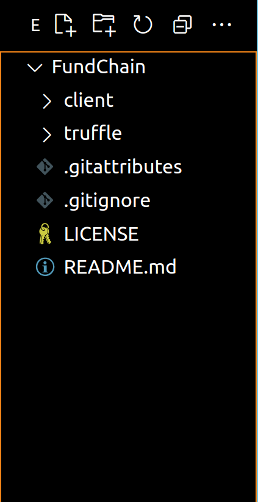
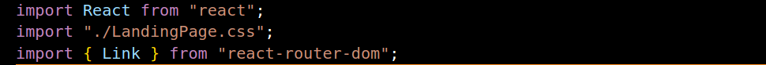
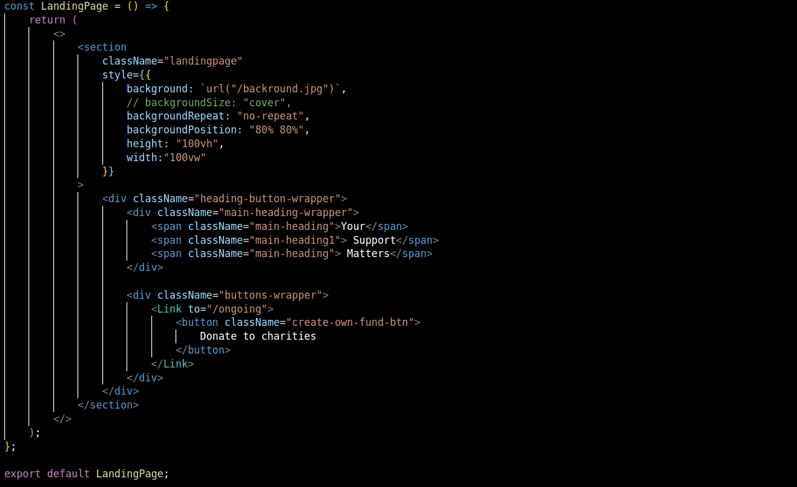
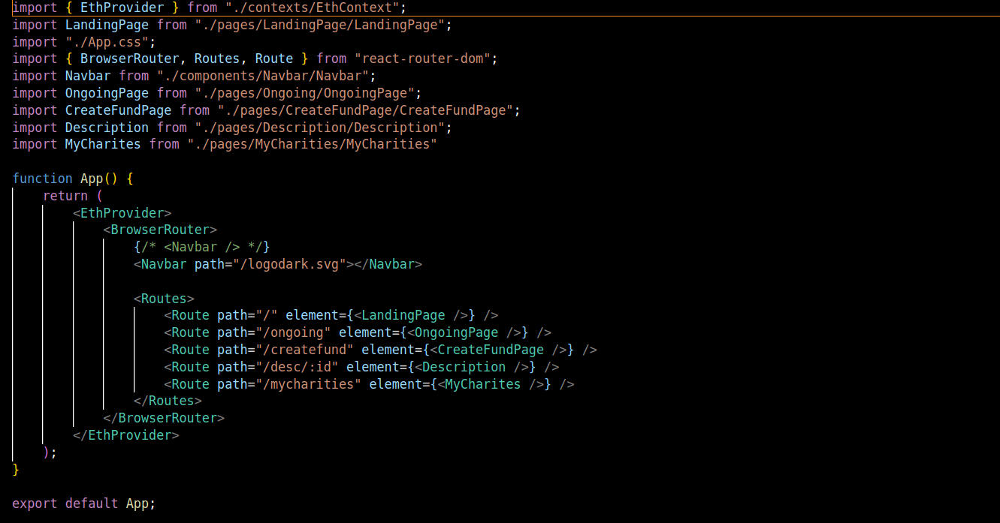

 Now it is time that we design the frontend of our blockchain project. For that we choose one of the most popularly used JavaScript framework for building user interfaces, React.

# React

 React is a JavaScript library that eases the designing and building process of the user interface using JavaScript. React is a component based language where the developer writes code for an element of the page (For example, a Nav bar used in this project itself is an element) only once and exports it. 
In the course of developing all the pages required for the website, the developer only needs to import the js folder that contains the element and use it at any required position.

### Getting Started with React

We directly jump into creating a react app, for that we need to install node. Download and install node [here](https://nodejs.org/en/download/) if not done already.
Next, we install NPM, Node Package Manager by a simple command:

`npm install -g`

 NPM is used to manage dependencies for packages. If you were to unpack a framework and use it outside NPM, you would have to do this every time you want to update the framework. NPM does this for you. You always know what version you're on, and you can limit a dependency to a specific version.

At this point we are ready to initiate our React application. In our project, we have two main directories that is the client and the truffle folder.

1. **Client :** This is where our client side application will reside.
2. **Truffle :** In this directory the solidity related files are stored.
So we make sure that our React files are created inside the client directory. (We change the current directory to client)
Here we type the command for creating the React app.

`npx create react app myapp`

NPX, Node Package Execute  as we ust want to run the react application, we dont really the packages to be installed in our system. This is possible using NPX. It is a package runner that comes along with NPM.

While in the same directory write the command

`npm install`

This command is very important as it installs all the dependenies that we will be requiring while building the interface.All the packages and their versions that get installed in the node_modules folder have their reference from a pre existing json file named package.json.

Once node_modules is installed successfully, enter the command

`npm start`

This should start our React app on localhost:3000. We are now ready to start building our own user interface. Make sure the file structure looks somewhat like this.

We now proceed to make the pages for our website. Under **src** directory we make the file structure somewhat like this.
1. **pages** directory contains all the different pages that we will be able to navigate through. Each of them contain a jsx and its corresponding css file.

Lets understand one of the pages, *LandingPage.jsx*. Firstly we import all the files that we require to use in this page.

Here under a function we return the jsx for the home page of our website and export it so that we can import them anywhere in our react project.

This way we make rest of the required pages.

2. **components** directory contains code for those elements that we want to render very frequently or in some case in every page. (Like the **Navbar** in our project) 

### App.jsx
This is an important file to study about bacause this file controls the routing of all the files that we want to use in our react project. 

#### Routing
Routing is a process in which a user is directed to different pages based on their action or request. ReactJS Router is mainly used for developing Single Page Web Applications. React Router is used to define multiple routes in the application. When a user types a specific URL into the browser, and if this URL path matches any 'route' inside the router file, the user will be redirected to that particular route.
As always we first import all the files and packages required in this page. In our case we route through our pages this way:

It is interesting to note that we have put the Navbar outside the route tag, this is done when we need an element to be executed in all the pages that gets rendered on routing. For example when we rote to the path "localhost:3000/ongoing"
the page that is rendered is somewhat like this:

Navbar on the very top and then the *ongoing.jsx* page. This happens for all the pages that are under Route tag
